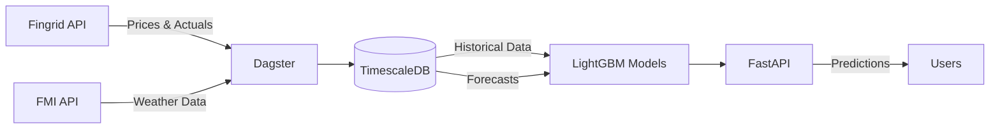

# ⚡ Ilmanhinta

Finnish electricity consumption prediction using weather data. Built with TimescaleDB and LightGBM.

## What this does

Pulls electricity data from Fingrid and weather data from FMI, then predicts next 24h consumption using LightGBM with 30+ engineered features. The predictions can beat Fingrid's own forecasts. Also includes an hourly price forecasting pipeline with forecast-only features and analytics to compare ML vs Fingrid.

## Quick start

```bash
# Needs Python 3.11+ and uv
git clone https://github.com/jererobles/ilmanhinta.git
cd ilmanhinta

# Setup everything
make setup

# Add your Fingrid API key to .env (get one from data.fingrid.fi)
# Run migrations
./scripts/run_migrations.sh

# Start the stack
make docker-up
```

Then hit `http://localhost:8000/predict/peak` for predictions.

## Architecture



The pipeline:

1. Dagster fetches data every hour (prices, consumption, weather, forecasts)
2. TimescaleDB stores everything with hypertables for fast queries
3. Price model fetches latest forecasts and fuses with historical prices
4. Models retrain daily at 2 AM with aligned features
5. FastAPI serves predictions with confidence intervals

## The ML stuff

### Consumption Model

LightGBM with 30+ engineered features:

- Time-based: hour, day of week, month, weekend indicator
- Lag features: consumption at t-1h, t-3h, t-6h, t-12h, t-24h, t-48h, t-168h
- Rolling statistics: mean/std/min/max over various windows
- Weather features: temperature, humidity, wind, pressure, wind chill

Performance: ~200-300 MW RMSE on test set. The weather features make a big difference - especially temperature.

### Price Model

Advanced feature engineering with forecast-aware historical fusion:

- **Price lag features**: 1h, 2h, 3h, 24h (yesterday same hour), 48h, 168h (last week same hour)
- **Rolling statistics**: mean and std over 6h, 12h, 24h, 168h windows
- **Momentum features**: hour-over-hour and day-over-day price differences
- **Forecast integration**: FMI weather forecasts (temperature, wind, humidity) and Fingrid forecasts (consumption, production, wind)
- **Smart alignment**: Historical prices fused with forecast timestamps before feature computation to ensure train/predict consistency

The price model uses a two-stage approach:

1. Fetch latest forecasts from DB (weather + Fingrid)
2. Compute price features using historical data aligned to forecast times

## Stack

**Core:**

- TimescaleDB (PostgreSQL with time-series superpowers)
- Polars (way faster than pandas for our use case)
- LightGBM (gradient boosting)
- Dagster for orchestration
- FastAPI

**DevOps:**

- Docker Compose with two profiles (lite for dev, full with SigNoz)
- Alembic for migrations
- Logfire for tracing (optional, works without token)
- Pre-commit hooks with ruff

## Database

TimescaleDB gives us:

- Automatic partitioning by time
- Continuous aggregates (pre-computed stats)
- 70-95% compression on old data
- Regular PostgreSQL compatibility

Key tables:

**Historical data** (for training):

- `electricity_consumption`: 3-minute resolution Fingrid actuals
- `electricity_prices`: Hourly spot prices (EUR/MWh)
- `weather_observations`: Hourly FMI observations

**Forecast data** (for prediction features):

- `weather_forecasts`: FMI HARMONIE forecasts - latest per forecast_time
- `fingrid_forecasts`: Fingrid's own forecasts (consumption/production/wind/price)

**Model outputs**:

- `predictions`: Consumption model outputs with confidence intervals
- `model_predictions`: Price model outputs with confidence bounds

The forecast tables use `DISTINCT ON (forecast_time, station_id/forecast_type)` queries to always return the most recent forecast for each future timestamp, critical for feature alignment.

Plus materialized/helper views for analytics (hourly/daily stats, accuracy, model comparison).

## API

```bash
# Peak hour in next 24h
GET /predict/peak

# Full 24h forecast
GET /predict/forecast

# Prometheus metrics
GET /metrics

# Analytics & price comparison
GET /analytics/summary
GET /api/v1/comparison
```

## Development

```bash
# Run tests
make test

# Lint/format
make lint
make format

# Run locally
make run-api        # API on :8000
make run-dagster    # Dagster UI on :3000

# Docker commands
make docker-up      # Lite mode (console logs)
make docker-up-full # With SigNoz UI on :8080
make docker-down
```

## Config

Required:

- `FINGRID_API_KEY`: From data.fingrid.fi

Optional:

- `LOGFIRE_TOKEN`: For cloud tracing
- `FMI_STATION_ID`: Default is Helsinki (101004)
- `MODEL_RETRAIN_HOURS`: Default 24

## Data sources

**Fingrid**:

- Datasets: 124 (consumption), 192 (production), 75 (wind), 188 (nuclear), 194 (net import)
- Prices: 92 (imbalance), 93 (imbalance sale), 96 (imbalance buy), 106 (down‑regulation)
- 3-minute updates
- 10k requests/day limit

**FMI**:

- Weather observations and HARMONIE point forecasts
- Hourly resolution
- No auth needed

## TODO

- [ ] Add Prophet for better seasonality handling
- [ ] Multi-region support (multiple FMI stations - currently Helsinki only, could add Tampere, Turku, Oulu for regional price models)
- [ ] Real-time updates (3-min instead of hourly)
- [ ] Model drift detection with automated retraining triggers
- [ ] Backfill historical forecasts, add model versioning, A/B testing
- [ ] SigNoz custom dashboards for ML metrics (prediction accuracy, feature importance, drift alerts)

## License

MIT

## Notes

Built this because I wanted accurate consumption forecasts for spot price optimization. Turns out weather features + gradient boosting works pretty well for this use case.

Originally planned an ensemble with Prophet for seasonality, but LightGBM alone with good feature engineering gets solid results. Might add Prophet later if seasonal patterns need better handling.

### Technical decisions

**Feature alignment**: The trickiest part of price prediction is ensuring historical features align correctly with forecast timestamps. The solution: fetch forecasts first, then join historical prices to those exact timestamps before computing lag/rolling features. This guarantees train/predict consistency.

**Forecast freshness**: Using `DISTINCT ON` with `generated_at DESC` ensures we always use the latest available forecast for each future timestamp. Critical when multiple forecast runs exist.

**TimescaleDB**: Continuous aggregates make analytics instant, compression saves 70-95% storage on historical data. The hypertables handle the time-series partitioning automatically.

**Deployment**: Explored Fly.io, Railway, Render but settled on plain `docker-compose.yaml` - simpler to debug and no vendor lock-in.
