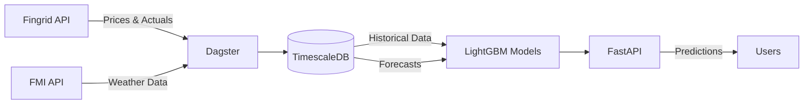

# ⚡ Ilmanhinta

Predicts Finnish electricity consumption using weather data. Uses TimescaleDB and LightGBM because they work.

[](https://github.com/yourusername/ilmanhinta/actions)
[](https://www.python.org/downloads/)
[](https://github.com/astral-sh/ruff)
[](http://mypy-lang.org/)

## What this actually does

Pulls electricity data from Fingrid and weather from FMI, then tries to predict the next 24h consumption. Uses LightGBM with some feature engineering. Sometimes beats Fingrid's predictions, sometimes doesn't. Also does price forecasting now with a similar approach.

## Quick start

```bash
# Needs Python 3.11+ and uv
git clone https://github.com/jererobles/ilmanhinta.git
cd ilmanhinta

# Setup everything
make setup

# Add your Fingrid API key to .env (get one from data.fingrid.fi)
# Run migrations
./scripts/run_migrations.sh

# Start the stack
make docker-up
```

Then hit `http://localhost:8000/predict/peak` for predictions.

## How it works



What happens:

1. Dagster fetches data every hour (prices, consumption, weather)
2. Everything goes into TimescaleDB
3. Price model grabs latest forecasts and mixes them with historical prices
4. Models retrain at 2 AM (might be overkill but whatever)
5. FastAPI serves predictions

## The ML bits

### Consumption Model

LightGBM with the usual time series features:

- Time stuff: hour, day of week, month, weekend flag
- Lag features: consumption from 1h, 3h, 6h, 12h, 24h, 48h, 168h ago
- Rolling stats: mean/std/min/max over different windows
- Weather: temperature, humidity, wind, pressure, wind chill

Gets ~200-300 MW RMSE. Temperature matters a lot (obviously - Finland is cold!).

### Price Model

Same idea but with price-specific features:

- Price lags: 1h, 2h, 3h, 24h, 48h, 168h
- Rolling windows: 6h, 12h, 24h, 168h
- Price changes: hour-over-hour, day-over-day
- Forecast data: weather forecasts + Fingrid's own predictions
- Feature alignment: makes sure historical and forecast features match up properly

The alignment thing was annoying to figure out. Basically fetch forecasts first, then compute features at those exact timestamps.

## Stack

**Main stuff:**

- TimescaleDB - PostgreSQL but handles time series better
- Polars - faster than pandas for this stuff
- LightGBM - gradient boosting, works well!
- Dagster - orchestration that doesn't suck
- FastAPI - easy API

**Dev stuff:**

- Docker Compose with profiles (lite mode for dev)
- Alembic for migrations
- Logfire for tracing (optional)
- ruff for formatting

## Database

TimescaleDB does:

- Auto partitioning by time
- Continuous aggregates (pre-computed hourly/daily stats)
- Compression on old data (saves like 80% space)
- Still just PostgreSQL so no weird syntax

Tables that matter:

**Historical** (training data):

- `fingrid_power_actuals`: 3-min resolution from Fingrid
- `fingrid_price_actuals`: Hourly spot prices
- `fmi_weather_observations`: Hourly FMI data

**Forecasts** (for prediction features):

- `fmi_weather_forecasts`: FMI weather predictions
- `fingrid_power_forecasts`: Fingrid's own forecasts

**Model outputs**:

- `predictions`: Consumption predictions
- `price_model_predictions`: Price predictions

Uses `DISTINCT ON` to get latest forecasts - took a while to get right.

## API

```bash
# Peak hour in next 24h
GET /predict/peak

# Full 24h forecast
GET /predict/forecast

# Metrics for monitoring
GET /metrics

# Compare our predictions vs Fingrid's
GET /api/v1/comparison
```

## Development

```bash
# Run tests
make test

# Format code
make format

# Run locally
make run-api        # API on :8000
make run-dagster    # Dagster UI on :3000

# Backfill forecasts (for analytics)
make backfill-forecasts                    # last month
make backfill-forecasts BACKFILL_HOURS=48  # last 2 days

# Docker
make docker-up      # Console logs
make docker-up-full # With SigNoz monitoring
make docker-down
```

## Config

Need:

- `FINGRID_API_KEY`: From data.fingrid.fi

Optional:

- `LOGFIRE_TOKEN`: If you want cloud tracing
- `FMI_STATION_ID`: Default is Helsinki (101004)
- `MODEL_RETRAIN_HOURS`: Default 24

## Data sources

**Fingrid**:

- Various datasets (124, 192, 75, etc - check their docs)
- 3-minute updates
- 10k requests/day limit (rarely hit it)

**FMI**:

- Weather observations and HARMONIE forecasts
- Hourly resolution
- Free, no auth

## What doesn't work great

Let's be real:

- Only uses Helsinki weather (should add more stations for regional models)
- Hourly updates instead of real-time (3-min would be better)
- No model drift detection (just retrains daily and hopes for the best)
- Missing seasonal patterns sometimes (might add Prophet later)
- Forecast backfilling is slow
- No A/B testing for model changes

## Future maybe

- [ ] Prophet for seasonality (if LightGBM keeps missing seasonal stuff)
- [ ] Multi-region support (Tampere, Turku, Oulu weather)
- [ ] Real-time updates (3-min)
- [ ] Drift detection that actually triggers retraining
- [ ] Model versioning (currently just overwrites)
- [ ] Better monitoring dashboards

## License

MIT

## Why this exists

Wanted to optimize my spot price electricity usage. Figured I'd need consumption forecasts for that.

Started simple with just time features, added weather, then forecasts. LightGBM handles it fine without getting fancy. The hardest part was getting the feature alignment right for price predictions - forecasts and historical data need to line up perfectly or the model learns nonsense.

Originally thought about doing an ensemble with Prophet but honestly the single model works well enough. Might revisit if seasonal patterns become a problem.

### Random technical notes

**Feature alignment**: Trickiest part. Solution: fetch forecasts first, then compute historical features at those exact timestamps. Otherwise train/predict features don't match.

**Forecast freshness**: `DISTINCT ON` with `generated_at DESC` gets latest forecast for each timestamp. Obvious in hindsight.

**TimescaleDB vs vanilla Postgres**: The continuous aggregates are nice for dashboards. Compression is real (80%+ on old data). Worth the extra complexity.

**Deployment**: Docker Compose > cloud platforms for this. Easier to debug, no surprises, runs anywhere.
